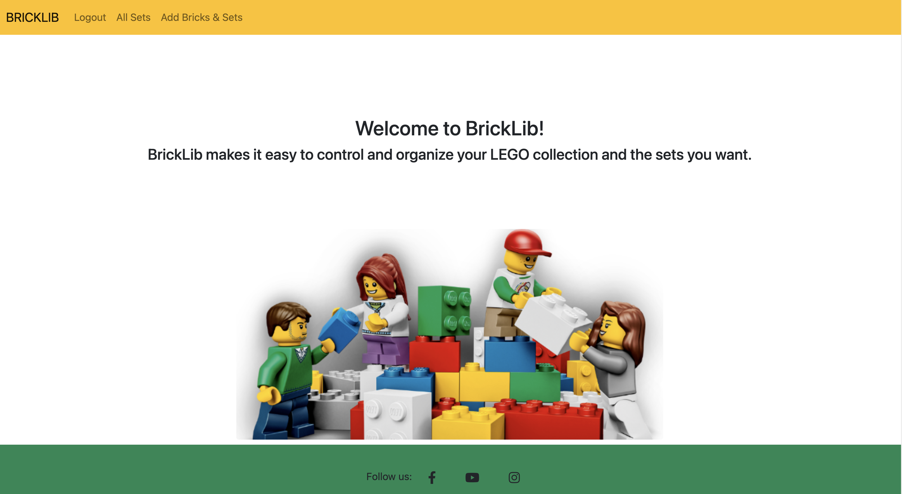
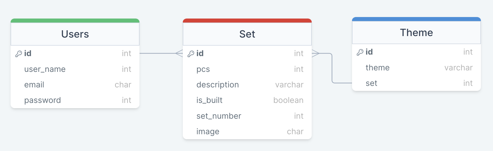

# BrickLib

[BrickLib](https://bricklib.herokuapp.com/) is a virtual platform for Lego collectors that allows users to create, update and delete their collection with other users around the world.
This site is built in Django using Python, Javascript, CSS and HTML to make it easy to keep track of your LEGO collection and the sets you want.

## Table of Contents

* [User Experience](#user-experience)  
  * [User Stories](#user-stories)

* [Design](#design)
  * [Fonts](#fonts)
  * [Color Scheme](#color-scheme)
  * [Wireframes](#wireframes)

* [Features](#features)
  * [Features Implemented](#features-implemented)
  * [Future Implementations](#future-implementations)

* [Database](#database)
  * [Database Schema](#database-schema)

* [Technologies](#technologies)
  * [Languages](#languages)
  * [Frameworks and Libraries](#frameworks-and-libraries)
  * [Programs](#programs)

* [Testing](#testing)

* [Deployment](#deployment)
  * [Initial Deployment](#initial-deployment)
  * [How To Fork A Repository](#how-to-fork-a-repository)
  * [How To Clone A Repository](#how-to-clone-a-repository)
  * [How To Make A Local Clone](#how-to-make-a-local-clone)

* [Testing](#testing)
  * [Code Validators](#code-validators)

* [Content](#content)
  * [Images](#images)
  * [Text Content](#text-content)

* [Acknowledgements](#acknowledgements)

[Back To Top](#dinotopia)

## User Experience
### User Stories
The structure of the site is designed to be simple and easy to use with clear information and simple steps.

* Users who want to keep track of their collection.
* Users who want to see the collections from different users
* Users who want to create their collection list and share it with other users.

### User Profile
* As a user I can register, sign up, sign out so that I can create my collections
* As a Site User I can view a list of sets so that I can select one to read.
* As a user I can sign in or sign out so that I can access the site or prevent others from accessing my profile
* As a user I can update my set & bricks so that I am able to see my updates
* As a User I can delete my set & bricks so that I can remove my sets & bricks

## User Goals

* The website needs to be accessible on all devices.
* The navbar needs to be visible and with clear information.
* The colors need to be compatible with the needs of the users.
* The images need to be compatible with the needs of the users.

#### Database Schema

The database schema was planned using [DrawSQL app](https://drawsql.app/). 

## Design
### Colour Scheme
The colour schema was planned using [Coolors.co](https://coolors.co/)
The choice of colors was based on Lego/Bricks colors that bring joy and fun.

##### Typography 
Roboto and Lato fonts were chosen to make it easier for the user to read.

##### Images
All images are from [Istock.com]https://www.istockphoto.com/

### Wireframes

Wireframes were created using [Balsamiq](https://balsamiq.com/) and exported into a png format, which can be viewed [here](docs/wireframes).

#### Technologies Used

* Python
    * The following python modules were used on this project:
          * asgiref==3.6.0
          * click==8.1.3
          * cloudinary==1.30.0
          * dj-database-url==0.5.0
          * dj3-cloudinary-storage==0.0.6
          * Django==3.2
          * django-allauth==0.52.0
          * django-summernote==0.8.20.0
          * Flask==2.2.2
          * gunicorn==20.1.0
          * itsdangerous==2.1.2
          * oauthlib==3.2.2
          * psycopg2==2.9.5
          * PyJWT==2.6.0
          * python3-openid==3.2.0
          * pytz==2022.7
          * requests-oauthlib==1.3.1
          * sqlparse==0.4.3
          * Werkzeug==2.2.2

* Django
    * Django was used as the main python framework in the development of this project
    * Django AllAuth was utilised to provide enhanced user account management functionality.
* Heroku
    * Was used as the cloud based platform to deploy the site on
* Heroku PostgreSQL
    * Heroku PostgreSQL was used as the database for this project during development and in production.
* JavaScript
    * Custom JavaScript was utilised to enable the colour scheme functionality, the mobile menu, the enabling and disabling of buttons on forms to prevent users inadvertantly causing errors when trying to submit multiple forms at the same time, and to display the current image in the form rather than a hyperlink to the image itself.
* Bootstrap 5.13
    * Bootstrap was used for general layout and spacing requirements for the site.
* Font Awesome
    * Was used for access to several icons for different sections where icons were appropriate.
* CSS
    * Custom css was written for a large number of areas on the site to implement custom styling and escape a bootstrap look and feel to the site.
* Jinja/Django Templating
    * Jinja/Django templating language was utilised to insert data from the database into the sites pages. It was also utilised to perform queries on different datasets.
* HTML
    * HTML was used as the base language for the templates created for the site.

#### Packages Used

* VS Code was used to develop the site
* Git was utilised for version control and transferring files between the code editor and the repository
* GitHub was utilised for storing the files for this project
* Balsamiq was utilised to develop wireframes for the site from which the design was based
* DrawSQL.app was used to develop the database schema during development

#### Resources Used

* The Django documentation was used extensively during development of this project
* The Django AllAuth documentation was used as a reference and a guide for implementing the package and its features.
* The Cloudinary documentation was used extensively during development to setup the configuration between django and the cloudinary apis
* The Code Institute reference material was used as a general reference for things that I had previously done during the course.
* All other resources used are referenced where appropriate.

## Testing 
 Utilised a manual testing strategy for the development of the site, wich can be view [here](TESTING.md).

## Deployment

The site was deployed via Heroku, and the live link can be found here - [BrickLib](https://bricklib.herokuapp.com/)

### Project Deployment

To deploy the project through Heroku I followed these steps:
* Sign up / Log in to [Heroku](https://www.heroku.com/)
* From the main Heroku Dashboard page select 'New' and then 'Create New App'
* Give the project a name - I entered Bricklib and select a suitable region, then select create app. The name for the app must be unique.
* This will create the app within Heroku and bring you to the deploy tab. From the submenu at the top, navigate to the resources tab.
* Add the database to the app, in the add-ons section search for 'Heroku Postgres', select the package that appears and add 'Heroku Postgres' as the database
* Navigate to the setting tab, within the config vars section copy the DATABASE_URL to the clipboard for use in the Django configuration.
* Within the django app repository create a new file called env.py - within this file import the os library and set the environment variable for the DATABASE_URL pasting in the address copied from Heroku. The line should appear as os.environ["DATABASE_URL"]= "Paste the link in here"
* Add a secret key to the app using os.environ["SECRET_KEY"] = "your secret key goes here"
* Add the secret key just created to the Heroku Config Vars as SECRET_KEY for the KEY value and the secret key value you created as the VALUE
* In the settings.py file within the django app, import Path from pathlib, import os and import dj_database_url
* insert the line if os.path.isfile("env.py"): import env
* remove the insecure secret key that django has in the settings file by default and replace it with SECRET_KEY = os.environ.get('SECRET_KEY')
* replace the databases section with DATABASES = { 'default': dj_database_url.parse(os.environ.get("DATABASE_URL"))} ensure the correct indentation for python is used.
* In the terminal migrate the models over to the new database connection
* Navigate in a browser to cloudinary, log in, or create an account and log in. 
* From the dashboard - copy the CLOUDINARY_URL to the clipboard
* in the env.py file created earlier - add os.environ["CLOUDINARY_URL"] = "paste in the Url copied to the clipboard here"
* In Heroku, add the CLOUDINARY_URL and value copied to the clipboard to the config vars
* Also add the KEY - DISABLE_COLLECTSTATIC with the Value - 1 to the config vars
* this key value pair must be removed prior to final deployment
* Add the cloudinary libraries to the list of installed apps, the order they are inserted is important, 'cloudinary_storage' goes above 'django.contrib.staitcfiles' and 'cloudinary' goes below it.
* in the Settings.py file - add the STATIC files settings - the url, storage path, directory path, root path, media url and default file storage path.
* Link the file to the templates directory in Heroku TEMPLATES_DIR = os.path.join(BASE_DIR, 'templates')
* Change the templates directory to TEMPLATES_DIR - 'DIRS': [TEMPLATES_DIR]
* Add Heroku to the ALLOWED_HOSTS list the format will be the app name given in Heroku when creating the app followed by .herokuapp.com
* In your code editor, create three new top level folders, media, static, templates
* Create a new file on the top level directory - Procfile
* Within the Procfile add the code - web: guincorn PROJECT_NAME.wsgi
* In the terminal, add the changed files, commit and push to GitHub
* In Heroku, navigate to the deployment tab and deploy the branch manually - watch the build logs for any errors.
* Heroku will now build the app for you. Once it has completed the build process you will see a 'Your App Was Successfully Deployed' message and a link to the app to visit the live site.

#### Forking the repository
By forking the GitHub Repository you can make a copy of the original repository to view or change without it effecting the original repository
This can be done by
    * Log into GitHub or create an account.
    * Locate the repository at https://github.com/paulasdev/BrickLib .
    * At the top of the repository, on the right side of the page, select "Fork" from the buttons available.
    * A copy of the repository should now be created in your own repository.